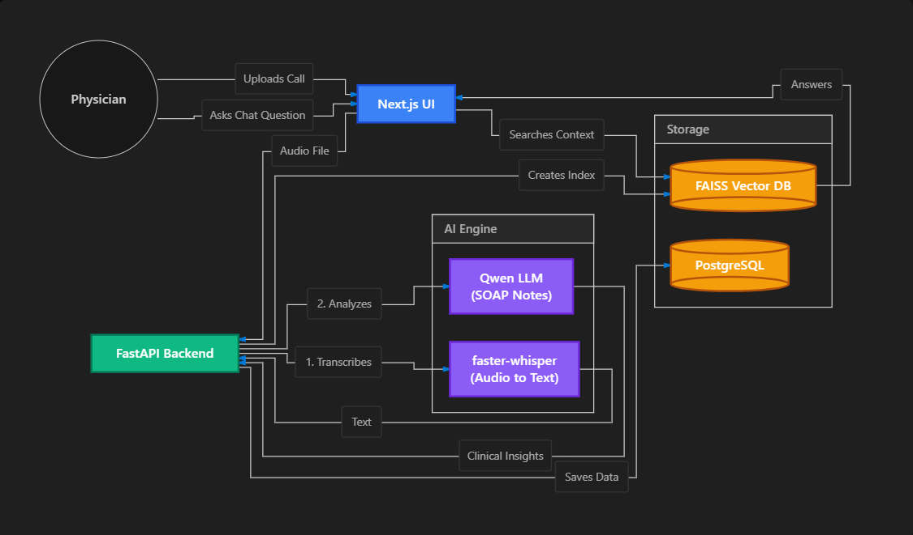

# MediCall — AI-powered Clinical Intelligence

Upload a medical call, stream transcription in real time, get AI-powered clinical insights (like SOAP notes), and ask grounded questions over the transcript.

## Architecture



```
POST /calls/upload          →  save audio, create DB record
WS   /calls/{id}/stream     →  transcribe → diarize → stream → analyze → insights
GET  /calls/{id}/insights   →  return computed analysis
POST /calls/{id}/query      →  RAG Q&A against transcript
GET  /calls                 →  list all past calls
```

## Pipeline

1. **Transcription** — faster-whisper (medium, CUDA, beam=5, VAD filter)
2. **Diarization** — pyannote/speaker-diarization-3.1 (forced 2 speakers)
3. **Role identification** — LLM maps speaker labels to Physician/Patient
4. **Intelligence** — LLM generates SOAP notes, extracts symptoms and prescriptions
5. **RAG indexing** — Hugging Face Inference API embeddings + FAISS vector store

## Core Features

- Audio upload (`.mp3`/`.wav`) with call session creation
- Real-time transcript streaming over WebSocket with word-by-word updates
- Post-call clinical intelligence:
  - Structured SOAP note generation
  - Patient Sentiment timeline
  - Extracted symptoms and prescribed medications
  - Follow-up recommendations
- RAG-powered Q&A over transcript with timestamp citations
- Speaker diarization with Physician/Patient role identification
- Persistent call history with searchable transcripts

## Tech Stack

| Layer | Technology |
|---|---|
| Backend | Python, FastAPI, Redis, PostgreSQL |
| STT | faster-whisper (medium, CUDA, float16) |
| Diarization | pyannote/speaker-diarization-3.1 |
| Embeddings | sentence-transformers/all-MiniLM-L6-v2 |
| RAG | FAISS vector store |
| LLM | HuggingFace Router (Qwen/9B via Together AI) |
| Frontend | Next.js 16, React 19, TypeScript |
| Package managers | `uv` (Python), `pnpm` (JS) |
| Deployment | Render (backend), Vercel (frontend) |

## Local Setup

### 1) Infrastructure

```bash
docker compose -f infra/docker-compose.yml up -d
```

### 2) Backend

```bash
cd backend
cp .env.example .env
# Edit .env — set HF_TOKEN at minimum
uv sync
uv run alembic upgrade head
uv run uvicorn app.main:app --reload --port 8000
```

OpenAPI docs at `http://localhost:8000/docs`

### 3) Frontend

```bash
cd frontend
pnpm install
pnpm dev
```

Set `NEXT_PUBLIC_API_URL=http://localhost:8000` in `frontend/.env.local`.

## Configuration

### Backend (`.env`)

| Variable | Default | Description |
|---|---|---|
| `HF_TOKEN` | | HuggingFace token (required for diarization + LLM) |
| `WHISPER_MODEL_SIZE` | `medium` | Whisper model size |
| `USE_LLM_INTELLIGENCE` | `true` | Use LLM for objection/action/score analysis |
| `HF_MODEL_ANALYSIS` | `Qwen/Qwen3.5-9B:together` | Primary LLM |
| `HF_MODEL_QA` | `Qwen/Qwen3.5-9B:together` | Fallback LLM for Q&A |

### Frontend (`.env.local`)

| Variable | Default | Description |
|---|---|---|
| `NEXT_PUBLIC_API_URL` | `http://localhost:8000` | Backend URL |

## Project Structure

```
medicall-app/
├── backend/
│   ├── app/
│   │   ├── services/
│   │   │   ├── models.py          # GPU model singleton cache
│   │   │   ├── transcription.py   # Whisper + pyannote pipeline
│   │   │   ├── intelligence.py    # LLM + rule-based analysis
│   │   │   ├── rag.py             # FAISS RAG indexing & query
│   │   │   ├── llm.py             # HuggingFace Router client
│   │   │   ├── orchestrator.py    # Processing graph
│   │   │   └── redis_state.py     # WebSocket event caching
│   │   ├── main.py                # FastAPI app + routes
│   │   ├── config.py              # Settings
│   │   ├── models.py              # SQLAlchemy ORM
│   │   └── schemas.py             # Pydantic schemas
│   └── storage/                   # Uploads + FAISS indexes
├── frontend/
│   ├── app/                       # Next.js App Router pages
│   ├── components/                # Reusable UI components
│   └── lib/                       # API client + types
└── infra/                         # Docker Compose + Render config
```

## Deployment

- **Backend:** use `infra/render.yaml`, configure env vars (`DATABASE_URL`, `REDIS_URL`, `HF_TOKEN`). Requires generous RAM.
- **Frontend:** deploy `frontend/` on Vercel, set `NEXT_PUBLIC_API_URL` to backend URL.

## How this maps to real-world clinical workflows

- **Automated Documentation:** SOAP note generation drastically reduces manual charting time for physicians.
- **Patient Monitoring:** Sentiment timeline identifies emotional shifts during tele-health consultations.
- **Treatment Tracking:** Automatic extraction of prescriptions and follow-ups captures critical care plans.
- **Knowledge Retrieval:** RAG Q&A makes long patient calls instantly searchable for quick medical review.
